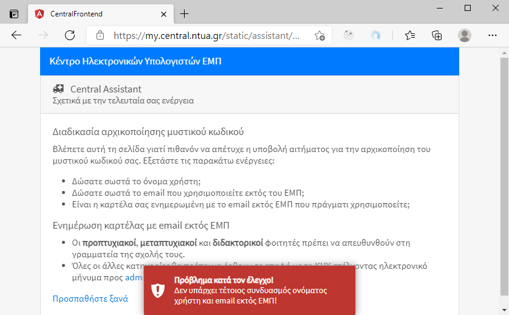
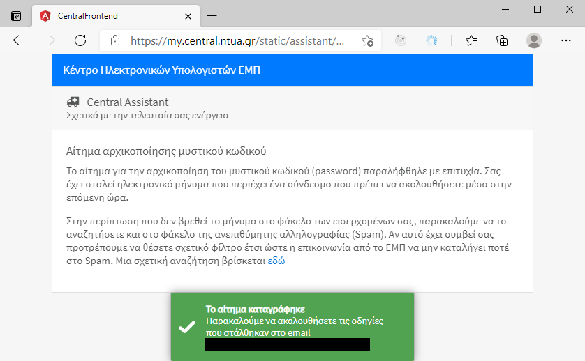

# Κωδικοί ηλεκτρονικών υπηρεσιών ΕΜΠ

Ολα τα μέλη του ΕΜΠ δικαιούνται να αποκτήσουν κωδικούς για τις ηλεκτρονικές
υπηρεσίες του ΕΜΠ. Ανάλογα με την ιδιότητα του μέλους οι διαδικασίες διαφέρουν
και αποτυπώνονται παρακάτω.

## Είμαι νέος προπτυχιακός φοιτητής. Πως λαμβάνω τους κωδικούς μου;

[[short url](https://bit.ly/3s8aFcT)]

> **Τα παρακάτω αφορούν όλους όσοι εισάγονται με τη διαδικασία των Πανελληνίων εξετάσεων και όχι με τη διαδικασία των μεταγραφών ή των ειδικών κατηγοριών.**

Συγχαρητήρια για την επιτυχία σας!

Η Γραμματεία της Σχολής σας θα σας καλέσει να καταθέσετε διάφορα δικαιολογητικά
έγγραφα για την ολοκλήρωση της εγγραφής σας. Θα ενημερωθούν τα προσωπικά σας
στοιχεία στο φοιτητολόγιο και μεταξύ άλλων θα σας ζητηθεί μια διεύθυνση
ηλεκτρονικής επικοινωνίας εκτός του ΕΜΠ (email π.χ. `username@gmail.com`). Αυτή
η διεύθυνση email είναι ιδιαίτερα σημαντικό στοιχείο της εγγραφής σας στη
γραμματεία. **Αλλάζει μόνο σε συννενόηση με τη γραμματεία σας, όπως και όλα τα
άλλα προσωπικά σας στοιχεία**.

**Μόνο όταν η γραμματεία οριστικοποιήσει τα δεδομένα σας** τότε αυτά θα περάσουν
*αυτόματα* προς το Κέντρο Ηλεκτρονικών Υπολογιστών και θα λάβετε ένα *αυτοματοποιημένο*
ενημερωτικό email που μεταξύ άλλων πληροφοριών θα σας ενημερώνει για τα **αναγνωριστικά
πρόσβασης** στις ηλεκτρονικές υπηρεσίες του ΕΜΠ:

- Όνομα χρήστη (user name)
- Μυστικός κωδικός (password): θα κληθείτε να ολοκληρώσετε την παρακάτω διαδικασία ["Ξέχασα το password"](https://bit.ly/31P1LpW).

**Τα αναγνωριστικά πρόσβασης που σας παρέχει το ΕΜΠ είναι αυστηρά προσωπικά και
δικαιούστε να τα χρησιμοποιείτε μόνο για εκπαιδευτικούς σκοπούς. Η χρήση τους
σημαίνει πως αυτόματα αποδέχεστε τον
[κανονισμό](http://www.noc.ntua.gr/files/docs/ntua_services_regulation.pdf)
αποδεκτής χρήσης των ηλεκτρονικών υπηρεσιών του ΕΜΠ.**

**ΠΡΟΣΟΧΗ: το ΕΜΠ και οι υπηρεσίες του ποτέ δεν θα ζητήσουν να αποκαλύψετε το μυστικό
σας κωδικό (password)! Δώστε ιδιαίτερη προσοχή στο να μην απαντάτε σε μηνύματα *phissing attack* 
(κάποιοι που προσπιούνται τις υπηρεσίες του ΕΜΠ και συνήθως αποστέλουν από το εξωτερικό)**.

## Δεν είμαι προπτυχιακός φοιτητής! Τι κάνω;

[[short url]()]

Πρέπει να ολοκληρωθούν τα παρακάτω βήματα:

- Συμπληρώστε την [αίτηση](applicationform.docx) χορήγησης αναγνωριστικών πρόσβασης στις ηλεκτρονικές υπηρεσίες του ΕΜΠ. Ολα τα στοιχεία είναι απαραίτητα.
- Στέλνετε ηλεκτρονικά το ηλεκτρονικά συμπληρωμένο έγγραφο στην αρμόδια υπηρεσία:
  * Οι ΔΕΠ, ΕΔΙΠ, ΕΤΕΠ, ΔΟΑΤΑΠ, Φοιτητές προς τη **Γραμματεία** της Σχολής
  * Οι Διοικητικοί υπάλληλοι, ΙΔΑΧ και ΙΔΟΧ προς τον **προϊστάμενό** τους
  * Οι Εξωτερικοί συνεργάτες προς το **συνεργαζόμενο μέλος ΔΕΠ**

- Η αρμόδια υπηρεσία **πρέπει να ελέγξει** ως προς την εγκυρότητά τους όλα τα πεδία του εγγράφου.
 Αν κάποιος **έλεγχος εγκυρότητας αποτύχει η αίτηση απορρίπτεται** υποχρεωτικά αλλιώς **η αρμόδια υπηρεσία** αποστέλει ηλεκτρονικά προς `adm<AT>central.ntua.gr` την **επιβεβαιωμένη** αίτηση.
- Μετά την παραλαβή της επιβεβαιωμένης αίτησης από την αρμόδια υπηρεσία, στο Κέντρο Ηλεκτρονικών Υπολογιστών ελέγχεται ή ύπαρξη ή μη προγενέστερων αναγνωριστικών πρόσβασης του ενδιαφερόμενου στο μητρώο του ΚΗΥ ανεξάρτητα της ιδιότητάς του (μεταπτυχιακός, διδάκτορας, εξωτερικός συνεργάτης, κτλ). Αν υπάρχουν προγενέστερα αναγνωριστικά πρόσβασης τότε αυτά ενεργοποιούνται εκ νέου.

## Γιατί έχουν ημερομηνία λήξης τα αναγνωριστικά πρόσβασης;

Τα αναγνωριστικά πρόσβασης στις ηλεκτρονικές υπηρεσίες του ΕΜΠ έχουν χρονική διάρκεια ισχύος όση 
είναι η χρονική διάρκεια της ενεργής σχέσης του ενδιαφερόμενου με το Ίδρυμα:
- **Απεριόριστη διάρκεια** έχουν αυτά των μόνιμων υπαλλήλων του ΕΜΠ (ΔΕΠ, ΕΔΙΠ, ΕΤΕΠ, Διοικητικοί, ΙΔΑΧ)
- Των **προπτυχιακών φοιτητών** μέχρι η Γραμματεία να τους σημάνει διπλωματούχους ή να τους δώσει για οποιοδήποτε λόγο αποφοιτήριο
- Των **μεταπτυχιακών φοιτητών ΔΠΜΣ** μέχρι δύο χρόνια
- Των **διδακτορικών φοιτητών** μέχρι έξι χρόνια
- Των **εξωτερικών συνεργατών** μέχρι δύο χρόνια

Οι παραπάνω καθορισμένες χρονικές διάρκειες μπορεί να παραταθούν για **δύο χρόνια** αν το
αιτηθεί
- ο επιβλέποντας καθηγητής ή ο διευθυντής του ΔΠΜΣ για τους φοιτητές
- το συνεργαζόμενο μέλος ΔΕΠ για τους εξωτερικούς συνεργάτες

## Γιατί χρειάζεται να διαθέτω email εκτός του ΕΜΠ;

[[short url](https://bit.ly/3fXNWxY)]

Όλοι οι χρήστες των ηλεκτρονικών υπηρεσιών του ΕΜΠ είναι **απαραίτητο** να διαθέτουν email διεύθυνση εκτός του ΕΜΠ και η καρτέλα τους στη βάση δεδομένων του ΚΗΥ να είναι ενημερωμένη με αυτή την πληροφορία. Οι λόγοι είναι οι παρακάτω:

- Μετά την επιτυχή δημιουργία του λογαριασμού σας στο ΕΜΠ, θα λάβετε στο εξωτερικό του ΕΜΠ email διάφορες χρήσιμες πληροφορίες, μεταξύ άλλων το όνομα χρήστη σας (username) και τον τρόπο που θα αρχικοποιήσετε τον μυστικό κωδικό πρόσβασή σας (password).
- Αν ξεχάσετε το μυστικό κωδικό πρόσβασης, τότε μετά από [κατάλληλες ενέργειες](https://bit.ly/31P1LpW), θα λάβετε εκεί ειδικά προσωποποιημένο σύνδεσμο (link) για την αρχικοποίηση του κωδικού σας.

## Ξέχασα το password

[[short url](https://bit.ly/31P1LpW)]

Επιλέξτε _"Ξέχασα το password"_ από την κεντρική σελίδα του `my.central.ntua.gr`:

Στη συνέχεια εισάγετε το όνομα χρήστη και τη διεύθυνση email που χρησιμοποιείτε εκτός του ΕΜΠ (απαραίτητα στοιχεία όπως λέει [εδώ](https://bit.ly/3fXNWxY)):

Αν για οποιοδήποτε λόγο τα στοιχεία σας δεν είναι ενημερωμένα θα λάβετε μήνυμα λάθους και θα πρέπει να προβείτε στις ενέργειες που εμφανίζονται.

Αν τα στοιχεία σας είναι ενημερωμένα τότε θα σας αποσταλεί ένα μήνυμα:

Θα πρέπει να αναζητήσετε το μήνυμα στη γραμματοθυρίδα σας:

Αφού διαβάσετε προσεκτικά το κείμενο και ακολουθήσετε το σύνδεσμο θα πρέπει να εισάγετε δύο
φορές τον νέο σας μυστικό κωδικό:

**Προσοχή: ο νέος σας μυστικός κωδικός θα πρέπει να είναι ισχυρός για να ενεργοποιηθεί το πεδίο της επιβεβαίωσης και τελικά να μπορέσετε να υποβάλετε το αίτημα της αρχικοποίησης του κωδικού:**

**Μερικές τυχαίες κοινές λέξεις είναι ισχυρότερο password από μια δύσκολη στην απομνημόνευση ακολουθία χαρακτήρων. Με άλλα λόγια το password `agapw poly th mairh` είναι ταυτόχρονα ισχυρότερο του `Tr0ub4dor&3` και ευκολότερο στην απομνημόνευση!**

Μετά την επιτυχή υποβολή του νέου μυστικού κωδικού:

Στη συνέχεια θα λάβετε και μήνυμα επιβεβαίωσης που σας **παρακαλούμε θερμά** να το διαβάσετε προσεκτικά:

## Μαζική απόδοση κωδικών σε φοιτητές ΔΠΜΣ ή διδακτορικούς

[[short url](https://bit.ly/3kV188S)]

Η διασικασία μαζικής απόδοσης κωδικών χρήσης ηλεκτρονικών υπηρεσιών του ΕΜΠ
στους μεταπτυχιακούς ή διδακτορικούς φοιτητές **αφορά αποκλειστικά και μόνο τη γραμματεία της
Σχολής** και προϋποθέτει την αποστολή προς `adm<AT>central.ntua.gr` ενός ορθά
συμπλήρωμένου λογιστικού φύλλου (Excel) με τις παρακάτω στήλες:

- Όνομα χρήστη (username): Παρακαλούμε να πληροφορήσετε τους ενδιαφερόμενους πως είναι απαραίτητο να περιέχει το πλήρες επώνυμο, π.χ. για το Γιώργο Παπαδόπουλο, gpapadopoulos ή giorgospapadopoulos. **Στην περίπτωση που στο παρελθόν, στα πλαίσια άλλου μεταπτυχιακού, ή αλλης σχέσης με το ΕΜΠ (π.χ. εξωτερικός συνεργάτης κτλ) ο ενδιαφερόμενος διέθετε όνομα χρήστη τότε θα πρέπει να το δηλώσει για να ενεργοποιηθεί εκ νέου.**
- Ονοματεπώνυμο
- Πατρώνυμο
- Μητρώνυμο
- Διεύθυνση κατοικίας, Περιοχή, ΤΚ
- τηλέφωνο κινητό
- εκτός ΕΜΠ mail **(όχι username@central.ntua.gr ή username@mail.ntua.gr)**
- Αριθμός Μητρώου
- Διευθυντής Μεταπτυχιακού για τους μεταπτυχιακούς ή επιβλέποντας καθηγητής για τους διδακτορικούς (να αναγράφεται και το Mail του)
- ημερομηνία λήξης του ΔΠΜΣ

**Δώστε ιδιαίτερη προσοχή στα παρακάτω:**

- **Δεν είναι δυνατή η χρήση των ονομάτων χρήστη των προπτυχιακών φοιτητών**. Όλοι οι κωδικοί χρήσης ηλεκτρονικών υπηρεσιών του ΕΜΠ απενεργοποιούνται οριστικά όταν οι προπτυχιακοί φοιτητές καθοριστούν από τη Γραμματεία διπλωματούχοι. 
- Δεν είναι δυνατή η απόδοση κωδικών χρήσης ηλεκτρονικών υπηρεσιών ΕΜΠ με την ιδιότητα του μεταπτυχιακού **αν προηγούμενα δεν έχει δηλωθεί ο φοιτητής διπλωματούχος** στο φοιτητολόγιο της Σχολής (**συντηρείται από την Διεύθυνση Πληροφορικής και όχι το ΚΗΥ**).
- Για την αποφυγή απόδοσης πολλαπλών κωδικών και την ελαχιστοποίηση της επικοινωνίας σχετικά με την κατάσταση των μεταπτυχιακών φοιτητών θα πρέπει **να δηλώνουν οι φοιτητές αν διαθέτουν παλαιότερους κωδικούς χρήσης ηλεκτρονικών υπηρεσιών ΕΜΠ** (ανεξάρτητα κατηγορίας, εκτός βέβαια του προπτυχιακού φοιτητή). 

## Μαζική ανανέωση κωδικών σε φοιτητές ΔΜΠΣ ή διδακτορικούς

[[short url](https://bit.ly/3F3JoQE)]

Η διαδικασία της ανανέωσης των κωδικών χρήσης ηλεκτρονικών υπηρεσιών του ΕΜΠ των
μεταπτυχιακών ή διδακτορικών φοιτητών γίνεται **αποκλειστικά και μόνο μετά από επικοινωνία
της γραμματείας της Σχολής** μετά από την αποστολή προς `adm<AT>central.ntua.gr` ενός
λογιστικού φύλλου (Excel) με δύο στήλες:

- Υπαρκτό όνομα χρήστη (μεταπτυχιακού ή διδακτορικού)
- Ημερομηνία λήξης (δεν μπορεί να υπερβαίνει τα δύο χρόνια).
