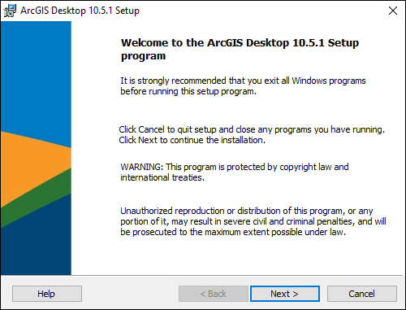

# ArcGIS

Ξεκινήστε με τη [λήψη](http://wiki.central.ntua.gr/software/download.html) του λογισμικού στον τοπικό σας υπολογιστή:

Επιλέξτε ένα προσωρινό χώρο για την αποσυμπίεση των αρχείων:

Περιμένετε να τελειώσει η αποσυμπίεση:

Η εγκατάσταση θα ξεκινήσει αυτόματα:

Αποδεχτείτε το License Agreement:

Επιλέξτε την πλήρη εγκατάσταση:

Επιλέξτε την τοποθεσία για την εγκατάσταση:

Επιλέξτε την τοποθεσία για την εγκατάσταση της Python:

Πατήστε το κουμπί Install:

Περιμένετε να ολοκληρωθεί η εγκατάσταση:

Η εγκατάσταση ολοκληρώθηκε:

Στο πλαίσιο _Define a License Manager now_ εισάγετε `arcgislicenses.central.ntua.gr`:

Η σύνδεση με το License Server ολοκληρώθηκε:

Μπορείτε να δείτε τη διαθεσιμότητα των επιμέρους χαρακτηριστικών:

Το λογισμικό είναι διαθέσιμο για χρήση:

**Απαραίτητη προϋπόθεση είναι να προηγηθεί η χρήση της υπηρεσίας [εικονικού ιδιωτικού δικτύου
(VPN)](https://bit.ly/2LedY2N) που προσφέρεται από το [Κέντρο Δικτύων
ΕΜΠ](https://bit.ly/32HMckw)¨:**

