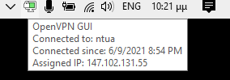

# Λήψη λογισμικών

[short url](https://bit.ly/354udG9)

Για να κατεβάσετε στον υπολογιστή σας τα διαθέσιμα λογισμικά είναι αρχικά
απαραίτητο να χρησιμοποιήσετε την υπηρεσία [εικονικού ιδιωτικού δικτύου
(VPN)](https://bit.ly/2LedY2N) που προσφέρεται από το [Κέντρο Δικτύων
ΕΜΠ](https://bit.ly/32HMckw).

Στη συνέχεια θα πρέπει να χρησιμοποιήσετε κάποιον [FTP
client](https://bit.ly/3uTwS16) όπως για παράδειγμα το
[WinSCP](https://bit.ly/2QmqxeN). Οι απαραίτητες ρυθμίσεις στο WinSCP φαίνονται
στην παρακάτω εικόνα (ανάλογα αν επιλέξετε άλλον ftp client):

Στα δεξιά θα εμφανίζονται τα περιεχόμενα του ftp server ενώ στα δεξιά μπορείτε
να ρυθμίσετε να εμφανίζεται ο κατάλογος `Downloads`. Στη συνέχεια μπορείτε να
κάνετε _drag and drop_ από τον ftp server προς στον τοπικό σας κατάλογο.

